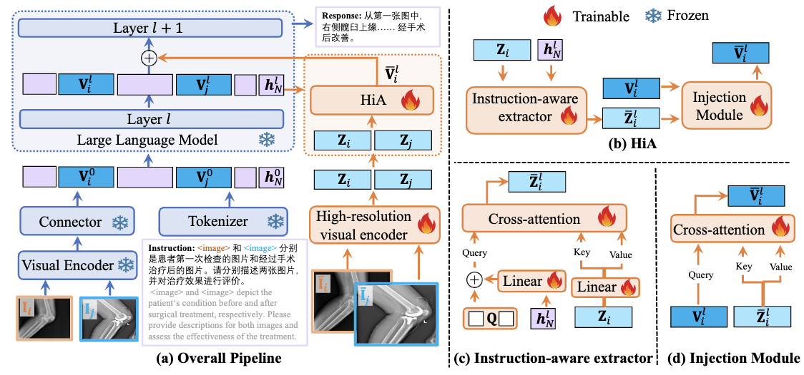

# HiA: Towards Chinese Multimodal LLMs for Comparative High-Resolution Joint Diagnosis

> Xinpeng Ding, Yongqiang Chu, Renjie Pi, Hualiang Wang, Xiaomeng Li

## 📖 Introduction

Multimodal large language models (MLLMs) have been explored in the Chinese medical domain for comprehending complex healthcare. However, due to the flaws in training data and architecture design, current Chinese medical MLLMs suffer from several limitations: cultural biases from English machine translations, limited comparative ability from single image input and difficulty in identifying small lesions with low-resolution images. To address these problems, we first introduce a new instruction-following dataset, Chili-Joint (Chinese Interleaved Image-Text Dataset for Joint Diagnosis) collected from the hospital in mainland China, avoiding cultural biases and errors caused by machine translation. Besides one single image input, Chili-Joint also has multple images obtained at various intervals during a patient’s treatment, thus facilitating an evaluation of the treatment’s outcomes. We further propose a novel HiA (High-resolution instruction-aware Adapter) to incorporate high-resolutioninstruction-aware visual features into LLMs to facilitate the current MLLMs to observe the small lesions as well as the comparative analysis. Extensive experiments on Chili-Joint demonstrate our HiA can be a plug-and-play method to improve the performance of current MLLMs for medical analysis.



## Training

```
sh scripts/finetune.sh
```

## Acknowledgement

Many thanks to the following awesome works!

- [LLaVA](https://github.com/haotian-liu/LLaVA)
- [Transformers](https://github.com/huggingface/transformers)
- [Qilin-Med-VL](https://github.com/williamliujl/Qilin-Med-VL/)
